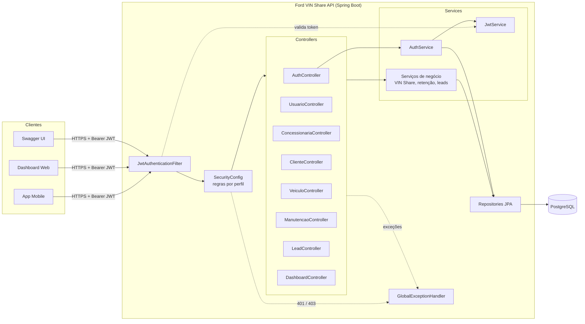
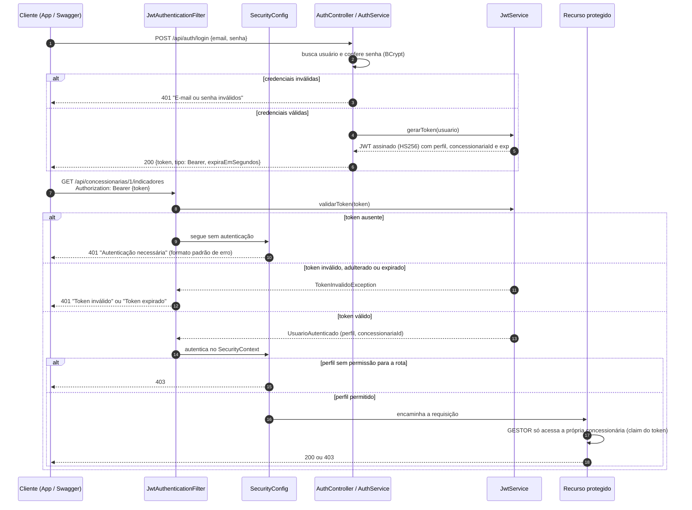
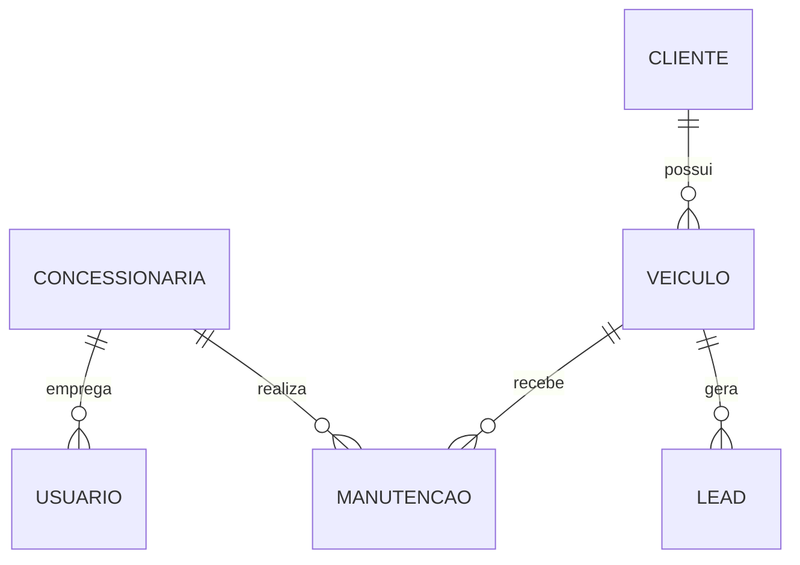

# Ford VIN Share API


API REST do **Desafio 2 da Challenge Ford + FIAP**: aumentar o **VIN Share** (percentual de veículos Ford que fazem manutenção na rede oficial) na América do Sul.

A API permite cadastrar clientes, veículos e concessionárias, registrar manutenções dentro ou fora da rede, acompanhar indicadores de retenção por concessionária e gerar **leads proativos** para trazer de volta os clientes em risco de sair da rede. O acesso é protegido por **JWT** com três perfis.

## Equipe

| Nome                    | RM       |
| ----------------------- | -------- |
| Milton Cezar Bacanieski | RM555206 |
| Victorio Bastelli       | RM554723 |
| Vitor Bebiano           | RM555026 |
| Lorenzo Mangini         | RM554901 |

## Critérios da Sprint 3 e onde encontrá-los

| Critério | Peso | Onde está |
| --- | --- | --- |
| Arquitetura da solução | 20% | [Diagramas de componentes e de autenticação](#arquitetura); camadas em `controller`, `service`, `repository`, `security`, `config` |
| Autenticação e autorização | 20% | `config/SecurityConfig.java`, [tabela de permissões](#perfis-e-permissões), restrição por concessionária em `ConcessionariaServiceImpl.obterIndicadores` |
| JWT | 15% | `security/JwtService.java` (geração e validação), `security/JwtAuthenticationFilter.java`, [seção JWT](#jwt) |
| Maturidade REST nível 2 | 20% | Controllers em `controller/`, [tabela de endpoints](#endpoints) com métodos e status codes |
| Testes automatizados | 15% | `src/test/java` (51 testes, 80% de cobertura de linhas), [evidências em `docs/`](docs/), [seção de testes](#testes-automatizados), execução no GitHub Actions |
| Documentação e erros | 10% | Swagger em `/swagger-ui.html` com botão Authorize, `exception/GlobalExceptionHandler.java`, este README |

## Stack

Java 17, Spring Boot 4, Spring Web MVC, Spring Security, JJWT 0.12, Spring Data JPA / Hibernate, PostgreSQL (H2 nos testes), Bean Validation, SpringDoc OpenAPI, Lombok, JUnit 5 + MockMvc, Maven e GitHub Actions.

## Arquitetura

A aplicação segue uma arquitetura em camadas, com responsabilidades separadas:

| Camada | Pacote | Responsabilidade |
| --- | --- | --- |
| Segurança | `security`, `config/SecurityConfig` | Validar o JWT de cada requisição, autenticar e aplicar as regras de acesso por perfil |
| Apresentação | `controller` | Expor os recursos REST, validar a entrada (`@Valid`) e definir status codes e headers |
| Contratos | `dto.request`, `dto.response` | Isolar o formato da API das entidades (a senha, por exemplo, nunca é devolvida) |
| Negócio | `service` | Regras de VIN Share, retenção, geração de leads, duplicidade e vínculos |
| Persistência | `repository`, `entity` | Acesso ao banco via Spring Data JPA |
| Erros | `exception` | Tradução de exceções para respostas HTTP em formato único |

### Diagrama de componentes



### Fluxo de autenticação e autorização



### Modelo de dados



## Como executar

Pré-requisitos: Java 17 e Docker (ou um PostgreSQL local).

```bash
# 1. Subir o banco
docker compose up -d

# 2. Rodar a API
./mvnw spring-boot:run
```

Acesse o Swagger em **http://localhost:8080/swagger-ui.html**.

Se já existir outro PostgreSQL usando a porta 5432 na sua máquina, suba o container em outra porta e aponte a API para ela:

```bash
DB_PORT=5434 docker compose up -d
DB_URL=jdbc:postgresql://localhost:5434/fordvinshare ./mvnw spring-boot:run
```

### Variáveis de ambiente

Todas têm valor padrão para desenvolvimento. Em produção, defina pelo menos `JWT_SECRET` e `DB_PASSWORD`.

| Variável | Padrão | Descrição |
| --- | --- | --- |
| `DB_URL` | `jdbc:postgresql://localhost:5432/fordvinshare` | URL do banco |
| `DB_USERNAME` / `DB_PASSWORD` | `postgres` / `postgres` | Credenciais do banco |
| `JWT_SECRET` | chave de desenvolvimento | Chave HMAC em Base64 (mínimo 256 bits) |
| `JWT_EXPIRATION_MINUTES` | `60` | Validade do token |
| `APP_SEED_ENABLED` | `true` | Cria concessionárias e usuários de teste se o banco estiver vazio |

### Usuários de teste

Criados automaticamente na primeira execução:

| Perfil | E-mail | Senha | Concessionária |
| --- | --- | --- | --- |
| ADMIN | `admin@ford.com` | `Admin@123` | nenhuma (acesso global) |
| GESTOR | `gestor@ford.com` | `Gestor@123` | Ford Centro SP |
| GESTOR | `gestor.campinas@ford.com` | `Gestor@123` | Ford Campinas |
| CONSULTOR | `consultor@ford.com` | `Consultor@123` | Ford Centro SP |

### Testando pelo Swagger

1. Abra `POST /api/auth/login`, clique em *Try it out* e envie `{"email": "admin@ford.com", "senha": "Admin@123"}`.
2. Copie o valor de `token` da resposta.
3. Clique em **Authorize** (cadeado no topo), cole o token e confirme.
4. Todos os endpoints passam a enviar `Authorization: Bearer <token>`.

O arquivo `requests.http` traz as mesmas chamadas prontas para o IntelliJ ou para a extensão REST Client do VS Code.

## Perfis e permissões

| Perfil | Quem é | O que pode fazer |
| --- | --- | --- |
| **ADMIN** | Equipe Ford | Tudo, incluindo exclusões, gestão de usuários e concessionárias e indicadores de qualquer concessionária |
| **GESTOR** | Gestor de pós-venda da concessionária | Dashboard, indicadores **apenas da própria concessionária**, geração de leads, cadastros |
| **CONSULTOR** | Consultor de serviços | Cadastrar clientes, veículos e manutenções, consultar e atualizar leads |

| Recurso | Público | CONSULTOR | GESTOR | ADMIN |
| --- | :-: | :-: | :-: | :-: |
| `POST /api/auth/login`, Swagger | ✅ | ✅ | ✅ | ✅ |
| `GET /api/auth/me` | | ✅ | ✅ | ✅ |
| Clientes, veículos e manutenções (GET, POST, PUT) | | ✅ | ✅ | ✅ |
| Qualquer `DELETE` | | | | ✅ |
| `GET /api/leads`, `PATCH /api/leads/{id}` | | ✅ | ✅ | ✅ |
| `POST /api/veiculos/{id}/leads`, `POST /api/leads/geracoes-automaticas` | | | ✅ | ✅ |
| `GET /api/dashboard/resumo` | | | ✅ | ✅ |
| `GET /api/concessionarias/{id}/indicadores` | | | ✅ (só a própria) | ✅ |
| `GET /api/concessionarias` | | ✅ | ✅ | ✅ |
| `POST/PUT/DELETE /api/concessionarias` | | | | ✅ |
| `/api/usuarios` | | | | ✅ |

As regras por rota ficam em `SecurityConfig`. A regra "GESTOR só vê a própria concessionária" depende do dado, então fica no serviço, comparando o `id` pedido com o claim `concessionariaId` do token.

## JWT

- **Geração** (`JwtService.gerarToken`): assinatura HMAC-SHA256 com a chave de `JWT_SECRET`.
- **Claims**: `sub` (e-mail), `uid`, `nome`, `perfil`, `concessionariaId`, `iss`, `iat`, `exp` e `jti`.
- **Validação** (`JwtService.validarToken`): assinatura, emissor (`iss`) e expiração (`exp`). Token adulterado, de outra chave, de outro emissor ou expirado é rejeitado com 401.
- **Filtro** (`JwtAuthenticationFilter`): lê o header `Authorization: Bearer <token>` de cada requisição. Se o token for inválido, responde 401 na hora, informando o motivo (`Token inválido` ou `Token expirado`).
- **Uso do token**: a API é *stateless* (sem sessão). O filtro monta o usuário autenticado a partir dos claims; o `perfil` vira a autoridade `ROLE_<PERFIL>` e o `concessionariaId` restringe o GESTOR.
- **Expiração**: 60 minutos por padrão (`JWT_EXPIRATION_MINUTES`); a resposta do login informa `expiraEmSegundos`.
- **Senhas**: armazenadas com BCrypt e nunca devolvidas. O login responde a mesma mensagem para e-mail inexistente e senha errada, para não revelar quais e-mails existem.

## Endpoints

Todos os caminhos são substantivos (recursos) e o verbo HTTP define a operação. Criações retornam **201 Created** com o header `Location`; exclusões retornam **204 No Content**.

| Método | Endpoint | Descrição | Sucesso | Erros |
| --- | --- | --- | --- | --- |
| POST | `/api/auth/login` | Autentica e devolve o JWT | 200 | 400, 401 |
| GET | `/api/auth/me` | Usuário do token | 200 | 401 |
| POST | `/api/usuarios` | Cria usuário | 201 | 400, 403, 409, 422 |
| GET | `/api/usuarios` · `/api/usuarios/{id}` | Lista / busca usuários | 200 | 403, 404 |
| DELETE | `/api/usuarios/{id}` | Remove usuário | 204 | 403, 404 |
| POST | `/api/concessionarias` | Cria concessionária | 201 | 400, 403, 409 |
| GET | `/api/concessionarias` · `/{id}` | Lista / busca | 200 | 404 |
| PUT | `/api/concessionarias/{id}` | Atualiza | 200 | 400, 403, 404, 409 |
| DELETE | `/api/concessionarias/{id}` | Remove (se não houver vínculos) | 204 | 403, 404, 409 |
| GET | `/api/concessionarias/{id}/indicadores` | Retenção da concessionária | 200 | 403, 404 |
| POST | `/api/clientes` | Cria cliente | 201 | 400, 409 |
| GET | `/api/clientes` · `/{id}` | Lista / busca | 200 | 404 |
| GET | `/api/clientes/{id}/veiculos` | Veículos do cliente | 200 | 404 |
| PUT | `/api/clientes/{id}` | Atualiza | 200 | 400, 404, 409 |
| DELETE | `/api/clientes/{id}` | Remove (se não houver veículos) | 204 | 403, 404, 409 |
| POST | `/api/veiculos` | Cria veículo (VIN validado) | 201 | 400, 404, 409 |
| GET | `/api/veiculos` · `/{id}` | Lista / busca | 200 | 404 |
| PUT | `/api/veiculos/{id}` | Atualiza | 200 | 400, 404, 409 |
| DELETE | `/api/veiculos/{id}` | Remove (se não houver manutenções/leads) | 204 | 403, 404, 409 |
| GET | `/api/veiculos/{id}/manutencoes` | Histórico de manutenções | 200 | 404 |
| POST | `/api/veiculos/{id}/leads` | Cria lead manual | 201 | 400, 403, 404 |
| POST | `/api/manutencoes` | Registra manutenção | 201 | 400, 404, 422 |
| GET | `/api/manutencoes` · `/{id}` | Lista / busca | 200 | 404 |
| DELETE | `/api/manutencoes/{id}` | Remove | 204 | 403, 404 |
| GET | `/api/leads?status=` | Lista leads (filtro opcional) | 200 | 400 |
| GET | `/api/leads/{id}` | Busca lead | 200 | 404 |
| PATCH | `/api/leads/{id}` | Atualiza o status do lead | 200 | 400, 404 |
| POST | `/api/leads/geracoes-automaticas` | Gera leads para veículos em risco | 201 | 403 |
| GET | `/api/dashboard/resumo` | Indicadores consolidados | 200 | 403 |

Toda rota protegida também pode responder **401** (token ausente, inválido ou expirado).

### Regras de negócio

- **VIN Share geral** = veículos com `utilizaRedeOficial = true` / total de veículos × 100.
- O campo `utilizaRedeOficial` segue a **manutenção mais recente** do veículo: se o cliente foi para uma oficina independente e depois voltou à concessionária, ele volta a contar no VIN Share.
- Manutenção na rede oficial exige `concessionariaId`; fora da rede, não deve informar concessionária (422).
- **Retenção da concessionária** = dos veículos já atendidos por ela, quantos continuam usando a rede oficial.
- **Geração automática de leads**: prioridade ALTA para veículos sem manutenção há mais de 180 dias; MEDIA para veículos fora da rede oficial. Não duplica lead se já houver um PENDENTE para o veículo.
- Exemplos de payload estão no Swagger e em `requests.http`.

## Tratamento de erros

Todas as falhas, inclusive 401 e 403 gerados pelo Spring Security, usam o mesmo formato:

```json
{
  "status": 403,
  "erro": "Acesso negado: você só pode consultar indicadores da sua concessionária",
  "timestamp": "2026-09-25T10:00:00",
  "path": "/api/concessionarias/2/indicadores"
}
```

Erros de validação trazem também a lista de campos:

```json
{
  "status": 400,
  "erro": "Campos inválidos",
  "timestamp": "2026-09-25T10:00:00",
  "path": "/api/veiculos",
  "campos": [
    { "campo": "vin", "mensagem": "VIN deve ter 17 caracteres alfanuméricos maiúsculos (sem I, O e Q)" }
  ]
}
```

| Status | Quando |
| --- | --- |
| 400 | Campos inválidos, JSON malformado, parâmetro com tipo errado |
| 401 | Credenciais inválidas; token ausente, inválido ou expirado |
| 403 | Perfil sem permissão ou concessionária de outro gestor |
| 404 | Recurso inexistente |
| 405 | Método HTTP não suportado no recurso |
| 409 | Registro duplicado (e-mail, VIN, CNPJ) ou exclusão com vínculos |
| 415 | Content-Type diferente de JSON |
| 422 | Violação de regra de negócio |
| 500 | Erro inesperado (registrado em log, sem expor detalhes internos) |

## Testes automatizados

```bash
./mvnw test
```

Os testes sobem a aplicação completa, com Spring Security e JWT reais, sobre um H2 em memória. Cada teste roda em uma transação desfeita ao final. A pipeline do GitHub Actions (`.github/workflows/ci.yml`) executa a suíte a cada push e publica os relatórios.

| Classe | Testes | O que cobre |
| --- | :-: | --- |
| `JwtServiceTest` | 6 | Geração e leitura de claims, token expirado, adulterado, de outra chave e de outro emissor |
| `AutenticacaoIntegrationTest` | 9 | Login válido/inválido, corpo inválido, 401 sem token, token malformado e expirado, `/me` sem senha, Swagger público |
| `AutorizacaoPerfisIntegrationTest` | 13 | 403 por perfil, exclusão só por ADMIN, gestor limitado à própria concessionária, criação de usuário, senha fraca |
| `RecursosRestIntegrationTest` | 12 | 201 + Location, 200, 400, 404, 405, 409 em clientes e veículos |
| `ManutencaoLeadIntegrationTest` | 8 | Regras de manutenção (422, data futura), retorno à rede, indicadores, geração automática e PATCH de leads |
| `DocumentacaoOpenApiIntegrationTest` | 2 | O contrato do Swagger bate com a API: 201/204 nas criações e exclusões, 401, 403, 409 e 422 onde de fato ocorrem |
| `FordVinshareApplicationTests` | 1 | Carregamento do contexto |

**Cobertura:** o JaCoCo gera o relatório em `target/site/jacoco/index.html` a cada `./mvnw test` (80% das linhas cobertas).

**Evidência da execução:**

- Pasta [`docs/`](docs/): prints e logs reais da execução dos testes e das chamadas à API (200, 401 e 403).
- Aba **Actions** do GitHub: cada push roda a suíte, mostra o resumo dos testes e da cobertura na página da execução e publica os relatórios (Surefire e JaCoCo) como artefato.
