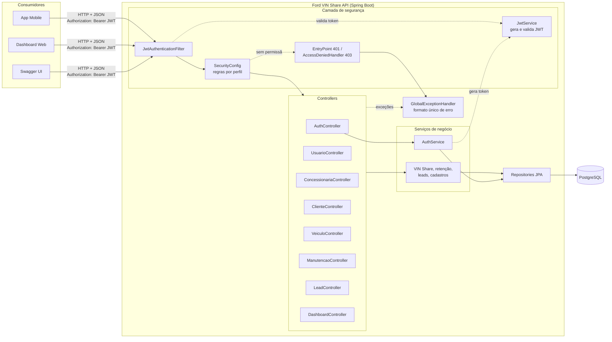
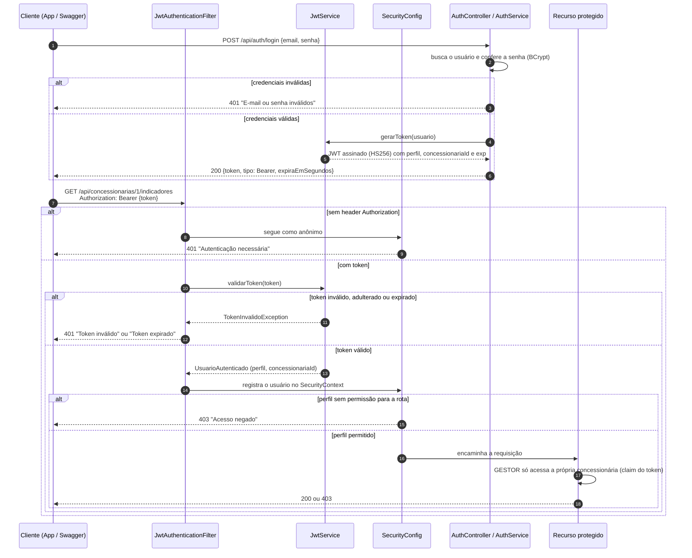

# Ford VIN Share API


API REST do **Desafio 2 da Challenge Ford + FIAP**: aumentar o **VIN Share**, que é o percentual de veículos Ford que fazem manutenção na rede oficial de concessionárias na América do Sul.

**O problema:** depois da garantia, muitos clientes passam a fazer a manutenção em oficinas independentes, e a Ford perde o contato com o veículo e com o cliente.

**A solução:** a API registra clientes, veículos, concessionárias e manutenções feitas dentro ou fora da rede oficial. Com esses dados, ela calcula o VIN Share e a taxa de retenção de cada concessionária e gera **leads proativos** para as concessionárias trazerem de volta os clientes em risco de sair da rede. O acesso é protegido por **JWT**, com três perfis de usuário.

## Sumário

- [Equipe](#equipe)
- [Critérios da Sprint 3](#critérios-da-sprint-3-e-onde-encontrá-los)
- [Tecnologias](#tecnologias)
- [Como executar](#como-executar)
- [Arquitetura](#arquitetura)
- [Perfis e permissões](#perfis-e-permissões)
- [JWT](#jwt)
- [Endpoints](#endpoints)
- [Regras de negócio](#regras-de-negócio)
- [Tratamento de erros](#tratamento-de-erros)
- [Testes automatizados](#testes-automatizados)

## Equipe

| Nome                    | RM       |
| ----------------------- | -------- |
| Milton Cezar Bacanieski | RM555206 |
| Victorio Bastelli       | RM554723 |
| Vitor Bebiano           | RM555026 |
| Lorenzo Mangini         | RM554901 |

## Critérios da Sprint 3 e onde encontrá-los

| Critério | Peso | Onde está |
| --- | :-: | --- |
| Arquitetura da solução | 20% | [Diagrama de componentes](#diagrama-de-componentes), [fluxo de autenticação](#fluxo-de-autenticação-e-autorização), [camadas e responsabilidades](#camadas-e-responsabilidades) |
| Autenticação e autorização | 20% | [`SecurityConfig`](src/main/java/br/com/fiap/fordvinshare/config/SecurityConfig.java), [tabela de permissões](#perfis-e-permissões), regra do GESTOR em [`ConcessionariaServiceImpl`](src/main/java/br/com/fiap/fordvinshare/service/ConcessionariaServiceImpl.java) |
| JWT | 15% | [`JwtService`](src/main/java/br/com/fiap/fordvinshare/security/JwtService.java) (geração e validação), [`JwtAuthenticationFilter`](src/main/java/br/com/fiap/fordvinshare/security/JwtAuthenticationFilter.java), [seção JWT](#jwt) |
| Maturidade REST nível 2 | 20% | [`controller/`](src/main/java/br/com/fiap/fordvinshare/controller), [tabela de endpoints](#endpoints) com métodos e status codes |
| Testes automatizados | 15% | [`src/test/java`](src/test/java/br/com/fiap/fordvinshare): 51 testes com 80% de cobertura, [evidências da execução](docs/README.md), pipeline no GitHub Actions |
| Documentação e erros | 10% | Swagger em `/swagger-ui.html`, [`GlobalExceptionHandler`](src/main/java/br/com/fiap/fordvinshare/exception/GlobalExceptionHandler.java), [formato de erro](#tratamento-de-erros), este README |

## Tecnologias

| Categoria | Tecnologia |
| --- | --- |
| Linguagem e framework | Java 17+, Spring Boot 4.0 (Spring Web MVC) |
| Segurança | Spring Security 7, JJWT 0.12 (JWT HS256), BCrypt |
| Persistência | Spring Data JPA / Hibernate, PostgreSQL 16 (H2 em memória nos testes) |
| Validação e documentação | Bean Validation, SpringDoc OpenAPI 3 (Swagger UI) |
| Testes | JUnit 5, MockMvc, Spring Security Test, JaCoCo |
| Build e CI | Maven (wrapper incluso), Docker Compose, GitHub Actions |

## Como executar

**Pré-requisitos:** Java 17 ou mais recente e Docker. Também dá para usar um PostgreSQL local no lugar do Docker.

```bash
# 1. Subir o PostgreSQL
docker compose up -d

# 2. Rodar a API (no Windows: mvnw.cmd spring-boot:run)
./mvnw spring-boot:run
```

A API sobe em `http://localhost:8080`. Links úteis:

- Swagger UI: **http://localhost:8080/swagger-ui.html**
- Contrato OpenAPI (JSON): http://localhost:8080/v3/api-docs

Na primeira execução, a API cria as tabelas e os [usuários de teste](#usuários-de-teste).

> **Porta 5432 ocupada?** Se já existir outro PostgreSQL na máquina, suba o container em outra porta e aponte a API para ela:
>
> ```bash
> DB_PORT=5434 docker compose up -d
> DB_URL=jdbc:postgresql://localhost:5434/fordvinshare ./mvnw spring-boot:run
> ```

### Variáveis de ambiente

Todas têm valor padrão para desenvolvimento. Em produção, defina pelo menos `JWT_SECRET` e `DB_PASSWORD`.

| Variável | Padrão | Descrição |
| --- | --- | --- |
| `DB_URL` | `jdbc:postgresql://localhost:5432/fordvinshare` | URL JDBC do banco |
| `DB_USERNAME` / `DB_PASSWORD` | `postgres` / `postgres` | Credenciais do banco |
| `DB_PORT` | `5432` | Porta publicada pelo container do `docker-compose.yml` |
| `JWT_SECRET` | chave de desenvolvimento | Chave HMAC em Base64 com pelo menos 256 bits |
| `JWT_EXPIRATION_MINUTES` | `60` | Validade do token, em minutos |
| `APP_SEED_ENABLED` | `true` | Cria os dados de teste se ainda não houver usuários |

### Usuários de teste

Criados automaticamente na primeira execução, junto com duas concessionárias:

| Perfil | E-mail | Senha | Concessionária |
| --- | --- | --- | --- |
| ADMIN | `admin@ford.com` | `Admin@123` | nenhuma (acesso global) |
| GESTOR | `gestor@ford.com` | `Gestor@123` | Ford Centro SP |
| GESTOR | `gestor.campinas@ford.com` | `Gestor@123` | Ford Campinas |
| CONSULTOR | `consultor@ford.com` | `Consultor@123` | Ford Centro SP |

### Testando pelo Swagger

1. Abra `POST /api/auth/login`, clique em **Try it out**, envie `{"email": "admin@ford.com", "senha": "Admin@123"}` e clique em **Execute**.
2. Copie o valor do campo `token` da resposta, sem as aspas.
3. Clique em **Authorize** (cadeado no topo da página), cole o token e confirme. A partir daí, o Swagger envia `Authorization: Bearer <token>` em todas as chamadas.
4. Execute `GET /api/clientes`. A resposta deve ser **200**.
5. Para ver a segurança recusando acessos:
   - **401:** clique em **Authorize → Logout** e repita a chamada.
   - **403:** faça login como `consultor@ford.com` e chame `GET /api/dashboard/resumo`, que é permitido só para GESTOR e ADMIN.

O arquivo [`requests.http`](requests.http) tem as mesmas chamadas prontas para o IntelliJ ou para a extensão REST Client do VS Code.

## Arquitetura

### Camadas e responsabilidades

A aplicação segue uma arquitetura em camadas. Cada camada tem uma única responsabilidade e só conversa com a camada vizinha.

| Camada | Pacote | Responsabilidade |
| --- | --- | --- |
| Segurança | `security`, `config/SecurityConfig` | Validar o JWT de cada requisição, identificar o usuário e aplicar as regras de acesso por perfil |
| Apresentação | `controller` | Expor os recursos REST, validar a entrada (`@Valid`) e definir status codes e headers |
| Contratos | `dto.request`, `dto.response` | Separar o formato da API das entidades. A senha, por exemplo, nunca é devolvida |
| Negócio | `service` | Regras de VIN Share, retenção, geração de leads, duplicidade e vínculos |
| Persistência | `repository`, `entity` | Acesso ao banco via Spring Data JPA |
| Erros | `exception` | Traduzir exceções em respostas HTTP com formato único |

```text
src/main/java/br/com/fiap/fordvinshare
├── config        SecurityConfig (regras de acesso), OpenApiConfig (Swagger), DataInitializer (dados de teste)
├── security      JwtService, JwtAuthenticationFilter, UsuarioAutenticado, handlers de 401 e 403
├── controller    Auth, Usuario, Concessionaria, Cliente, Veiculo, Manutencao, Lead, Dashboard
├── service       Interfaces e implementações com as regras de negócio
├── repository    Interfaces Spring Data JPA
├── entity        Entidades JPA e enums (Perfil, StatusLead, PrioridadeLead)
├── dto           request/ (entrada validada) e response/ (saída)
└── exception     GlobalExceptionHandler, ConflitoException (409), RegraNegocioException (422)
```

### Diagrama de componentes



### Fluxo de autenticação e autorização



### Modelo de dados

```mermaid
erDiagram
    CONCESSIONARIA ||--o{ USUARIO : "emprega"
    CONCESSIONARIA ||--o{ MANUTENCAO : "realiza"
    CLIENTE ||--o{ VEICULO : "possui"
    VEICULO ||--o{ MANUTENCAO : "recebe"
    VEICULO ||--o{ LEAD : "gera"

    CONCESSIONARIA {
        Long id
        String nome
        String cnpj "único"
        String cidade
        String uf
    }
    USUARIO {
        Long id
        String nome
        String email "único"
        String senha "hash BCrypt"
        Perfil perfil "ADMIN, GESTOR, CONSULTOR"
        Boolean ativo
    }
    CLIENTE {
        Long id
        String nome
        String email "único"
        String telefone
        LocalDate dataCadastro
    }
    VEICULO {
        Long id
        String vin "único, 17 caracteres"
        String marca
        String modelo
        Integer anoFabricacao
        Boolean utilizaRedeOficial
    }
    MANUTENCAO {
        Long id
        LocalDate dataServico
        String tipoServico
        BigDecimal valor
        Boolean realizadaNaRedeOficial
        String observacoes
    }
    LEAD {
        Long id
        LocalDate dataGeracao
        String motivoLead
        StatusLead status "PENDENTE, CONTATADO, CONVERTIDO, PERDIDO"
        PrioridadeLead prioridade "BAIXA, MEDIA, ALTA"
    }
```



## Perfis e permissões

| Perfil | Quem é | O que pode fazer |
| --- | --- | --- |
| **ADMIN** | Equipe Ford | Tudo, incluindo exclusões, gestão de usuários e de concessionárias e indicadores de qualquer concessionária |
| **GESTOR** | Gestor de pós-venda de uma concessionária | Dashboard, indicadores **apenas da própria concessionária**, criação e geração de leads e cadastros |
| **CONSULTOR** | Consultor de serviços de uma concessionária | Cadastrar e consultar clientes, veículos e manutenções, consultar e atualizar leads |

| Recurso | Público | CONSULTOR | GESTOR | ADMIN |
| --- | :-: | :-: | :-: | :-: |
| `POST /api/auth/login` e Swagger | ✅ | ✅ | ✅ | ✅ |
| `GET /api/auth/me` | | ✅ | ✅ | ✅ |
| Clientes e veículos: `GET`, `POST`, `PUT` e sub-recursos | | ✅ | ✅ | ✅ |
| Manutenções: `GET`, `POST` | | ✅ | ✅ | ✅ |
| `GET /api/leads`, `GET /api/leads/{id}`, `PATCH /api/leads/{id}` | | ✅ | ✅ | ✅ |
| `GET /api/concessionarias`, `GET /api/concessionarias/{id}` | | ✅ | ✅ | ✅ |
| `POST /api/veiculos/{id}/leads`, `POST /api/leads/geracoes-automaticas` | | | ✅ | ✅ |
| `GET /api/dashboard/resumo` | | | ✅ | ✅ |
| `GET /api/concessionarias/{id}/indicadores` | | | ✅ (só a própria) | ✅ |
| `POST` e `PUT /api/concessionarias` | | | | ✅ |
| `/api/usuarios` (todos os métodos) | | | | ✅ |
| Qualquer `DELETE` | | | | ✅ |

As regras por rota ficam no [`SecurityConfig`](src/main/java/br/com/fiap/fordvinshare/config/SecurityConfig.java). A regra "o GESTOR só vê a própria concessionária" depende do dado pedido, e não só da rota. Por isso ela fica no serviço, que compara o `id` da URL com o claim `concessionariaId` do token.

## JWT

**Geração** (`JwtService.gerarToken`): no login, a API assina o token com HMAC-SHA256 usando a chave de `JWT_SECRET`. Exemplo real do conteúdo (payload) de um token do GESTOR:

```json
{
  "sub": "gestor@ford.com",
  "iss": "ford-vinshare-api",
  "jti": "3cfda171-b23b-4b37-8ad2-18ffe6e997a9",
  "iat": 1790347836,
  "exp": 1790351436,
  "uid": 2,
  "nome": "Gestor Centro SP",
  "perfil": "GESTOR",
  "concessionariaId": 1
}
```

| Claim | Uso |
| --- | --- |
| `sub` | E-mail do usuário |
| `iss` | Emissor. Tokens de outro emissor são rejeitados |
| `iat` / `exp` | Data de emissão e de expiração (60 minutos por padrão) |
| `jti` | Identificador único do token |
| `uid`, `nome` | Identificação do usuário sem consultar o banco |
| `perfil` | Vira a autoridade `ROLE_<PERFIL>` usada nas regras de acesso |
| `concessionariaId` | Limita o GESTOR aos dados da própria concessionária (ausente para o ADMIN) |

- **Validação** (`JwtService.validarToken`): confere a assinatura, o emissor (`iss`) e a expiração (`exp`). Token adulterado, assinado com outra chave, de outro emissor ou expirado é rejeitado com **401**.
- **Filtro** (`JwtAuthenticationFilter`): lê o header `Authorization: Bearer <token>` em cada requisição. Se o token for inválido, responde 401 na hora e informa o motivo: `Token inválido` ou `Token expirado`.
- **Stateless**: não há sessão nem cookie. Cada requisição se autentica sozinha com o token, por isso o CSRF fica desativado.
- **Expiração**: configurável em `JWT_EXPIRATION_MINUTES`. A resposta do login informa `expiraEmSegundos`.
- **Senhas**: guardadas com hash BCrypt e nunca devolvidas pela API. Precisam ter de 8 a 64 caracteres, com letra maiúscula, letra minúscula, número e símbolo. O login responde a mesma mensagem para e-mail inexistente e para senha errada, para não revelar quais e-mails estão cadastrados.

## Endpoints

Os caminhos são substantivos (recursos) e o método HTTP define a operação. Criações retornam **201 Created** com o header `Location` apontando para o novo recurso, e exclusões retornam **204 No Content**.

| Método | Endpoint | Descrição | Sucesso | Erros |
| --- | --- | --- | :-: | --- |
| POST | `/api/auth/login` | Autentica e devolve o JWT | 200 | 400, 401 |
| GET | `/api/auth/me` | Dados do usuário do token | 200 | 401 |
| POST | `/api/usuarios` | Cria usuário | 201 | 400, 403, 409, 422 |
| GET | `/api/usuarios` · `/api/usuarios/{id}` | Lista / busca usuários | 200 | 403, 404 |
| DELETE | `/api/usuarios/{id}` | Remove usuário | 204 | 403, 404 |
| POST | `/api/concessionarias` | Cria concessionária | 201 | 400, 403, 409 |
| GET | `/api/concessionarias` · `/api/concessionarias/{id}` | Lista / busca | 200 | 404 |
| PUT | `/api/concessionarias/{id}` | Atualiza | 200 | 400, 403, 404, 409 |
| DELETE | `/api/concessionarias/{id}` | Remove, se não houver vínculos | 204 | 403, 404, 409 |
| GET | `/api/concessionarias/{id}/indicadores` | Indicadores de retenção | 200 | 403, 404 |
| POST | `/api/clientes` | Cria cliente | 201 | 400, 409 |
| GET | `/api/clientes` · `/api/clientes/{id}` | Lista / busca | 200 | 404 |
| GET | `/api/clientes/{id}/veiculos` | Veículos do cliente | 200 | 404 |
| PUT | `/api/clientes/{id}` | Atualiza | 200 | 400, 404, 409 |
| DELETE | `/api/clientes/{id}` | Remove, se não houver veículos | 204 | 403, 404, 409 |
| POST | `/api/veiculos` | Cria veículo com VIN validado | 201 | 400, 404, 409 |
| GET | `/api/veiculos` · `/api/veiculos/{id}` | Lista / busca | 200 | 404 |
| PUT | `/api/veiculos/{id}` | Atualiza | 200 | 400, 404, 409 |
| DELETE | `/api/veiculos/{id}` | Remove, se não houver manutenções ou leads | 204 | 403, 404, 409 |
| GET | `/api/veiculos/{id}/manutencoes` | Histórico de manutenções | 200 | 404 |
| POST | `/api/veiculos/{id}/leads` | Cria lead manual para o veículo | 201 | 400, 403, 404 |
| POST | `/api/manutencoes` | Registra manutenção | 201 | 400, 404, 422 |
| GET | `/api/manutencoes` · `/api/manutencoes/{id}` | Lista / busca | 200 | 404 |
| DELETE | `/api/manutencoes/{id}` | Remove | 204 | 403, 404 |
| GET | `/api/leads?status=` | Lista leads, com filtro opcional por status | 200 | 400 |
| GET | `/api/leads/{id}` | Busca lead | 200 | 404 |
| PATCH | `/api/leads/{id}` | Atualiza só o status do lead | 200 | 400, 404 |
| POST | `/api/leads/geracoes-automaticas` | Gera leads para veículos em risco | 201 | 403 |
| GET | `/api/dashboard/resumo` | Indicadores consolidados | 200 | 403 |

Toda rota protegida também pode responder **401** (token ausente, inválido ou expirado). O Swagger documenta os mesmos status para cada operação, e um teste automatizado garante que a documentação continue igual ao comportamento da API.

## Regras de negócio

- **VIN Share** (`GET /api/dashboard/resumo`): veículos com `utilizaRedeOficial = true` ÷ total de veículos × 100.
- **Uso da rede oficial**: o campo `utilizaRedeOficial` segue a **manutenção mais recente** do veículo. Se o cliente foi para uma oficina independente e depois voltou à concessionária, ele volta a contar no VIN Share. Veículos sem manutenção registrada começam como `true`.
- **Manutenção**: na rede oficial exige `concessionariaId`, e fora da rede não pode informar concessionária. Nos dois casos, a violação responde **422**. A data do serviço não pode ser futura (**400**).
- **Retenção da concessionária** (`GET /api/concessionarias/{id}/indicadores`): dos veículos já atendidos pela concessionária, a porcentagem que continua usando a rede oficial.
- **Geração automática de leads** (`POST /api/leads/geracoes-automaticas`):
  - prioridade **ALTA** para veículos sem manutenção nos últimos 180 dias;
  - prioridade **MEDIA** para veículos com manutenção recente, mas fora da rede oficial;
  - não gera um lead novo se o veículo já tiver um lead `PENDENTE`.
- **Status do lead**: todo lead nasce `PENDENTE`, e a concessionária atualiza o andamento para `CONTATADO`, `CONVERTIDO` ou `PERDIDO` via `PATCH /api/leads/{id}`.
- **Unicidade**: e-mail de cliente e de usuário, VIN e CNPJ não se repetem (**409**). Registros com vínculos não podem ser excluídos (**409**).

## Tratamento de erros

Todas as falhas usam o mesmo formato, inclusive os 401 e 403 gerados pelo Spring Security:

```json
{
  "status": 403,
  "erro": "Acesso negado: você só pode consultar indicadores da sua concessionária",
  "timestamp": "2026-09-25T11:05:10.453088",
  "path": "/api/concessionarias/2/indicadores"
}
```

Erros de validação trazem também a lista de campos inválidos:

```json
{
  "status": 400,
  "erro": "Campos inválidos",
  "timestamp": "2026-09-25T11:05:10.781243",
  "path": "/api/veiculos",
  "campos": [
    { "campo": "vin", "mensagem": "VIN deve ter 17 caracteres alfanuméricos maiúsculos (sem I, O e Q)" }
  ]
}
```

| Status | Quando |
| --- | --- |
| 400 | Campos inválidos, JSON malformado ou parâmetro com tipo errado |
| 401 | Credenciais inválidas ou token ausente, inválido ou expirado |
| 403 | Perfil sem permissão, ou GESTOR acessando outra concessionária |
| 404 | Recurso inexistente |
| 405 | Método HTTP não suportado no recurso |
| 409 | Registro duplicado (e-mail, VIN, CNPJ) ou exclusão de registro com vínculos |
| 415 | `Content-Type` diferente de JSON |
| 422 | Violação de regra de negócio |
| 500 | Erro inesperado. Fica registrado em log, sem expor detalhes internos na resposta |

## Testes automatizados

```bash
./mvnw test
```

Os testes não precisam do Docker. Eles sobem a aplicação completa, com Spring Security e JWT reais, sobre um banco H2 em memória. Cada teste roda em uma transação desfeita ao final, então um teste não interfere no outro.

| Classe | Testes | O que cobre |
| --- | :-: | --- |
| `JwtServiceTest` | 6 | Geração e leitura dos claims, e rejeição de token expirado, adulterado, de outra chave e de outro emissor |
| `AutenticacaoIntegrationTest` | 9 | Login válido e inválido, corpo inválido, 401 sem token, token malformado e expirado, `/me` sem expor a senha, Swagger público |
| `AutorizacaoPerfisIntegrationTest` | 13 | 403 por perfil, exclusão só pelo ADMIN, GESTOR limitado à própria concessionária, criação de usuário, senha fraca |
| `RecursosRestIntegrationTest` | 12 | 201 com `Location`, 200, 400, 404, 405 e 409 em clientes e veículos, e sub-recursos |
| `ManutencaoLeadIntegrationTest` | 8 | Regras de manutenção (422, data futura), retorno à rede oficial, indicadores, geração automática e `PATCH` de leads |
| `DocumentacaoOpenApiIntegrationTest` | 2 | Contrato do Swagger igual ao da API: 201 e 204, e 401, 403, 409 e 422 onde de fato ocorrem |
| `FordVinshareApplicationTests` | 1 | Carregamento do contexto da aplicação |
| **Total** | **51** | Cenários de sucesso, de erro e de acesso não autorizado |

**Cobertura:** o JaCoCo gera o relatório em `target/site/jacoco/index.html` a cada `./mvnw test`. Hoje, 80% das linhas estão cobertas.

**Evidências da execução:**

- [`docs/README.md`](docs/README.md): resultado dos testes, relatório de cobertura, prints do Swagger (login, Authorize, 200, 401 e 403) e [15 chamadas reais à API](docs/evidencias/chamadas-api.md) com requisição e resposta.
- Aba **Actions** do GitHub: a [pipeline](.github/workflows/ci.yml) roda a suíte a cada push e mostra o resumo dos testes e da cobertura na página da execução. Os relatórios do Surefire e do JaCoCo ficam disponíveis como artefato.
