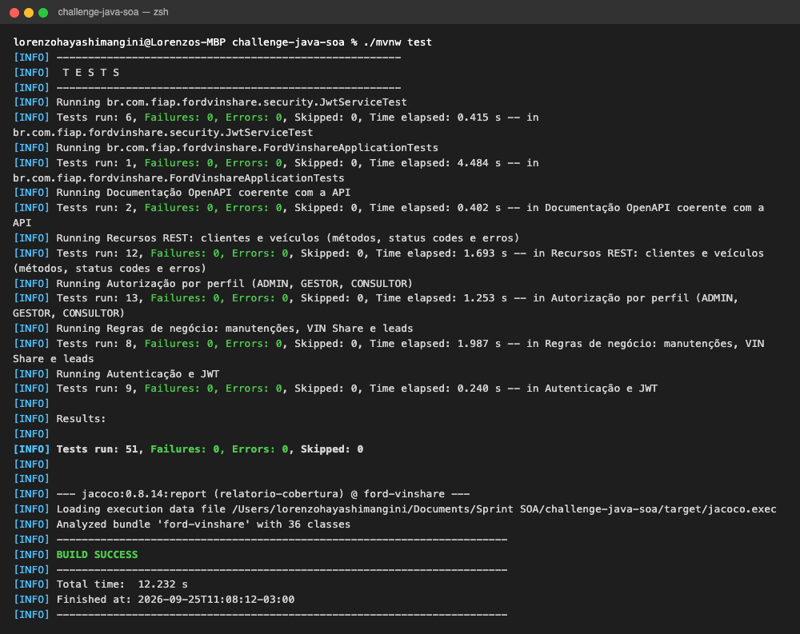
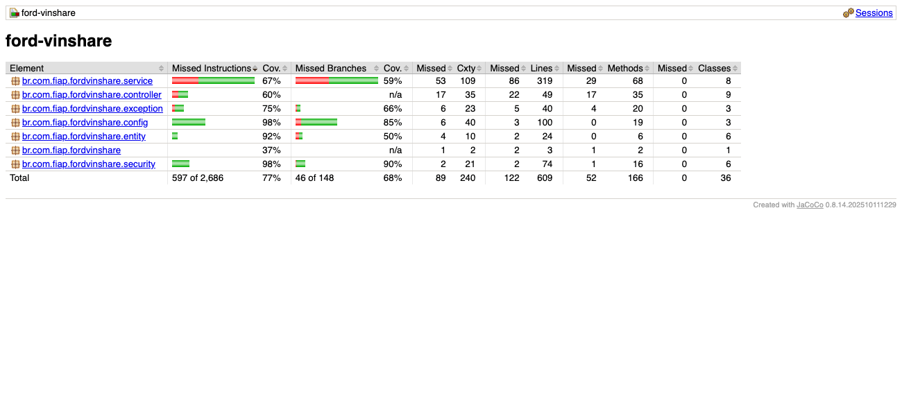
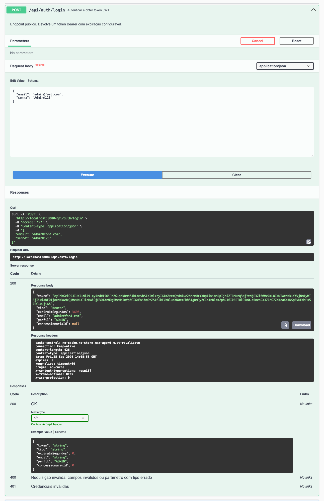
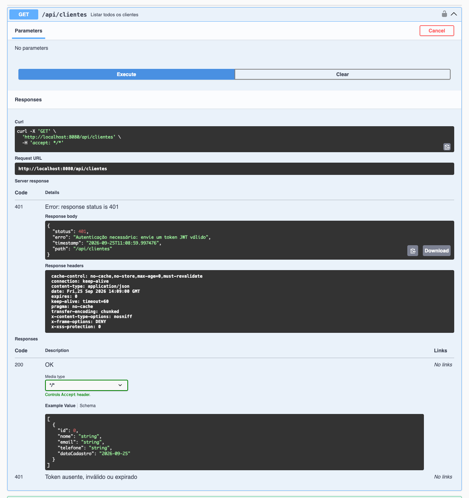
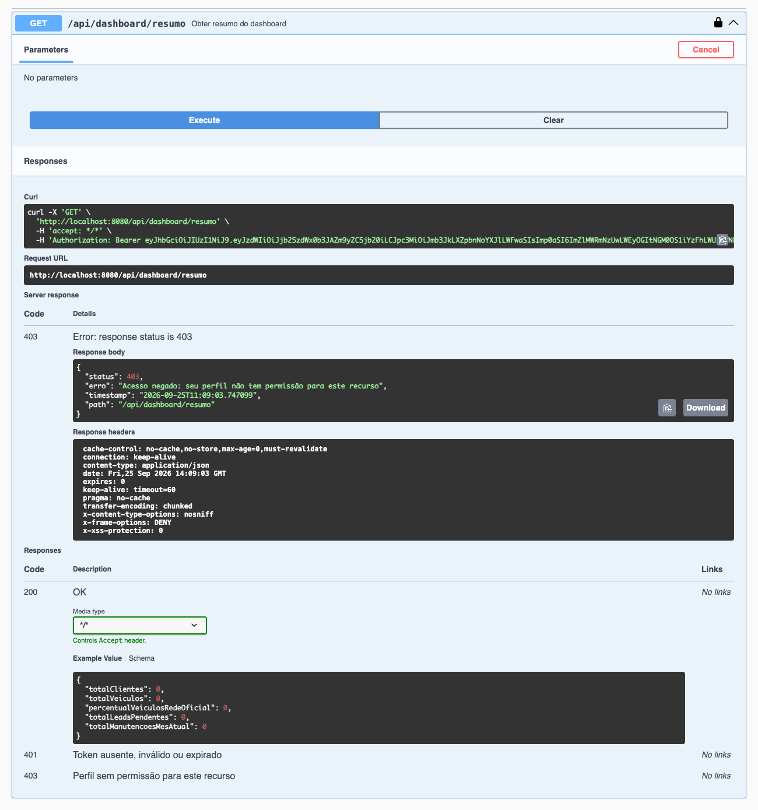

# Evidências da Sprint 3

Execução real da solução em 25/09/2026, com a API rodando localmente (Spring Boot + PostgreSQL no Docker).

## Testes automatizados

**51 testes, 0 falhas, `BUILD SUCCESS`**, com 80% das linhas cobertas pelos testes.

| Evidência | Arquivo |
| --- | --- |
| Saída do `./mvnw test` (texto) | [resultado-testes.txt](evidencias/resultado-testes.txt) |
| Saída do `./mvnw test` (print) | [07-testes-build-success.png](evidencias/07-testes-build-success.png) |
| Relatório de cobertura JaCoCo | [08-cobertura-jacoco.png](evidencias/08-cobertura-jacoco.png) |
| Execução no GitHub Actions | aba **Actions** do repositório (resumo dos testes e da cobertura em cada execução) |

## Autenticação, JWT e autorização pelo Swagger

| # | Cenário | Resultado |
| :-: | --- | :-: |
| 1 | [Swagger com todos os recursos e o botão Authorize](evidencias/01-swagger-visao-geral.png) | — |
| 2 | [Login público com `admin@ford.com`: token JWT, tipo Bearer e expiração](evidencias/02-swagger-login-200.png) | 200 |
| 3 | [Token informado no Authorize](evidencias/03-swagger-authorize.png) e [autorização confirmada](evidencias/03-swagger-authorize-confirmado.png) | — |
| 4 | [Chamada autenticada: `GET /api/clientes` com token](evidencias/04-swagger-autenticado-200.png) | 200 |
| 5 | [Mesma chamada sem token](evidencias/05-swagger-sem-token-401.png) | 401 |
| 6 | [CONSULTOR tentando acessar `GET /api/dashboard/resumo`](evidencias/06-swagger-consultor-403.png) | 403 |

### Login (200)

### Sem token (401)

### Perfil sem permissão (403)

## Chamadas à API com requisição e resposta

O arquivo [chamadas-api.md](evidencias/chamadas-api.md) registra 15 chamadas reais com a requisição e a resposta completas:

- **Autenticação:** login 200 e 401, e `/me`.
- **Acesso não autenticado:** 401 sem token e com token adulterado.
- **Autorização por perfil:** 403 do CONSULTOR e 200/403 do GESTOR conforme a concessionária do token.
- **Status codes REST:** 201 com `Location`, 409, 400 com a lista de campos, 404, 405 e filtro por status.
